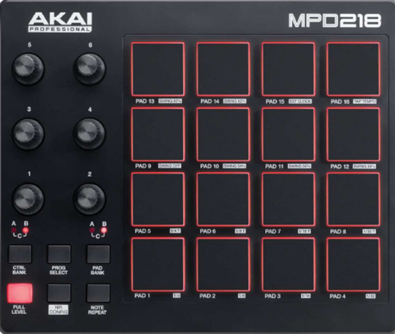
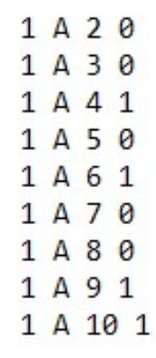

# Sampler

<font size="4"> <strong>This project was realized on Raspberry PI 4 and coded in C++.</strong> </font> 

To carry out this project, i needed a Pad Controller, the AKAI MPD 218,which is the basis of the project



This Pad Controller has several notable features, including 6 adjustable
adjustable potentiometers and 16 programs that can be freely changed with 3 bank (A, B, C), you can press 16 visible pads. You can have 16 pads in a bank and 3 banks in a program, making a total of 768 pads. Like most electronic communicates via MIDI signal.

# Solution for projet

A MIDI signal is a communication protocol and file format dedicated to
dedicated to music that enables communication between the electronic instrument and the computer. Here, our signal will be in the form: "channel, pad, velocity". 
In effect, the channel corresponds to the path used, the pad to the pad pressed and the velocity to the force in which the pad is pressed. velocity to the force with which the pad is pressed.

To make this system mobile, the screen has to be removed, which is not possible in the street. This requires automatic program startup on the Raspberry.

For musicians, latency is very important and must be imperceptible to the human ear. if latency is too high, they can't play.

To make things easier to understand, you need to associate a sound with a pad, so that all sounds can be played easily and you can easily choose your sound library library (Program). Some sounds have a different status like "Loops" : These are sounds that are repeated ad infinitum.
but also stop. A backlight is active when a loop is played. A configuration file defines these statuses. A certain pad has reset status, to restart the program. restart the program.


### Start without screen on Raspberry PI 4 :

Autostart is possible thanks to the file that is executed when the the Raspberry's startup, forcing HDMI port security and launching the program. to prevent a crash, the program is restarted ad infinitum with a sound to announce this.

```sh
aconnect 28:MPD218 14:MIDI Through #hdmi_force_hotplug = 1
aconnect 24:MPD218 14:MIDI Through #normal
aconnect 20:MPD218 14:MIDI Through #hdmi_ignore_hotplug = 1

# Lancement du programme
cd ..
pkill -f ./Sampler
make sampler

while true
do
	aplay conf/play.wav
	make lancement
done
```

### Compling code :

Compilation is carried out using a MakeFile, which can be used to execute specific command lines using keywords such as "Make Sampler"

### Loop or not ? :

I decided to create a coded language that is written to a text file to facilitate to facilitate the transmission of these configurations:



In a very precise order, we first have the program number, the Bank used used, the Pad number, to determine whether it's a sound or a loop.

### Read a Signal Midi :

We will use the "RTMIDI" library. It several interesting features: The opening of an OUT and IN port, so that the machine communicates with us and vice versa.

Example : 

```cpp
RtMidiIn *midiin;
RtMidiOut *midiout;

midiin = new RtMidiIn();
midiout = new RtMidiOut();
midiin->openPort(1);
midiout->openPort(1);
```

<font size="2"> <strong>As a reminder, the signal will take the form: "channel, pad, velocity".</strong> </font> 


<font size="3"> <strong>To identify the program or a triggering mode so "RtMidiOut", we use the
MIDI signal with : </strong> </font> 


| Channels | Description           |
| :---------------:|:---------------:|
| Canal 144 to Canal 160  |   A basic message and it returns the program. Example: 144 for 1, 145 for 2...     |  
| Canal 160 to Canal 176  | An additional message to the basic message, if the pad is held down          |  
| Canal 128 to Canal 144 | A message to complete the message, if the pad has been released       |
| Canal 176  | Channel reserved for potentiometers       |


The same goes for recognizing the bank according to the pad :

| Pads | Description           |
| :---------------:|:---------------:|
| Pad 0 to Pad 15  |   Bank A    |  
| Pad 16 to Pad 31  | Bank B         |  
| Pad 32 to Pad 47| Bank C   |

Example with code :

```cpp
std::vector<unsigned char> message;
stamp = midiin->getMessage( &message );	
canal = message[0];
pad = message[1];
velocite = message[2];
if(...)
```

<font size="3"> <strong>To identify the program for Backlight so "RtMidiIN", we use the
MIDI signal with : </strong> </font> 

| Channels | Description           |
| :---------------:|:---------------:|
| Canal 144 to 160 |  A message that is sent to illuminate according to the program   |  
| Canal 128 to 144 | A message is sent to turn off the backlight.        |  

he same goes for recognizing the bank according to the pad :

| Pads | Description           |
| :---------------:|:---------------:|
| Pad 0 to Pad 15  |   Bank A    |  
| Pad 16 to Pad 31  | Bank B         |  
| Pad 32 to Pad 47| Bank C   |

```cpp
std::vector<unsigned char> messageout;
messageout[0] = 128;
messageout[1] = padTouchLoop.at(0);
messageout[2] = 0;
midiout->sendMessage(&messageout);
```

### Play music :

Few sound libraries are available in C++, or they use technologies that are not open source and therefore have to be paid for. They often require a system other than a  Raspberry. However, [SMFL](https://www.sfml-dev.org/), a multi-media API, has all the features
can be compiled in C++ thanks to the ALSA (Driver Audio) driver available on Raspberry.

With the latter, you can freely load a sound into memory, play a sound, stop a sound, know the status of the launch, all of which saves development time. The format used for music is WAV, a lossless format. A sound has a well-defined path in the project folder. For example, the sound of pad one of bank A and program one: "/sounds/Program1/BankA/Pad0.wav".

Example with code : 

```cpp
Pad::Pad(string Asound, bool isLoop, int number)
{
	this->sound.setPath(Asound);
	this->isLoop = isLoop;
	this->isInit = false;
	this->number = number;
	this->buffer.loadFromFile(this->sound.getPath());
}

void Pad::play(int volume)
{
	this->init();
	this->Music->setBuffer(buffer);
	this->Music->play();
}
```

To avoid loading 768 songs into memory, I use a system of Init

Example with code : 

```cpp
void Pad::init()
{
	if(this->isInit == false)
	{
		this->Music = new sf::Sound();
		this->isInit = true;
    }
}
```
# Conclusion

I've decided to make this project freely available, so if you have any questions, please don't hesitate to contact me. 


